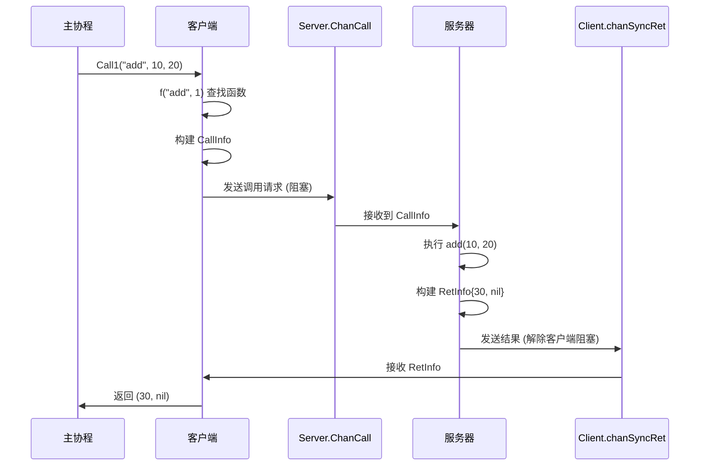

# chanrpc 同步调用完整流程解析

## 前言

chanrpc 实现 RPC 功能的核心思想是：**通过 Go 的 channel 作为消息传递机制，在客户端和服务器之间建立一个可靠的调用通道**。下面我们将一步步详细解析同步调用的完整流程。

## 场景设定

假设我们有一个简单的加法函数：
```go
// 服务器端注册的函数
func add(args []interface{}) interface{} {
    a := args[0].(int)
    b := args[1].(int)
    return a + b
}

// 客户端调用
result, err := client.Call1("add", 10, 20)
```

## 完整流程详解

### 第一阶段：环境准备

#### 1.1 创建服务器
```go
server := NewServer(100)  // 创建一个缓冲区大小为100的Server
```
- 创建 `functions` 映射表（用于存储注册的函数）
- 创建 `ChanCall` 通道（用于接收客户端调用请求）

#### 1.2 注册函数
```go
server.Register("add", add)
```
- 检查函数签名是否合法（必须是三种指定类型之一）
- 将函数存储到 `functions["add"] = add`

#### 1.3 启动服务器循环
```go
go func() {
    for ci := range server.ChanCall {
        server.Exec(ci)
    }
}()
```
- 在单独的 goroutine 中启动服务器事件循环
- 等待从 `ChanCall` 通道接收调用请求

#### 1.4 创建客户端
```go
client := server.Open(0)
```
- 创建一个新的 Client 实例
- 通过 `Attach(s *Server)` 将 Client 与 Server 关联
- 创建 `chanSyncRet` 通道（用于接收同步调用结果）

### 第二阶段：客户端发起调用

#### 2.1 客户端调用 Call1
```go
result, err := client.Call1("add", 10, 20)
```

#### 2.2 查找函数
```go
// 在 client.f() 方法内部
f, err := c.f("add", 1)  // 参数1表示期望返回单个值
```
- 检查 server 是否已附加
- 从 `server.functions["add"]` 获取函数
- 验证函数签名是否匹配 `func([]interface{}) interface{}`

#### 2.3 构建调用信息
```go
callInfo := &CallInfo{
    f:       add,                    // 要执行的函数
    args:    []interface{}{10, 20}, // 参数列表
    chanRet: c.chanSyncRet,         // 结果返回通道
    cb:      nil,                   // 同步调用无回调
}
```

#### 2.4 发送调用请求
```go
err = c.call(callInfo, true)  // true 表示阻塞发送
```

#### 2.5 通过 channel 传递请求
```go
// 在 client.call() 方法内部
c.s.ChanCall <- ci  // 将调用信息发送到服务器的通道
```
- 此时客户端 goroutine 会阻塞，等待服务器接收这个请求
- 服务器的事件循环会从 `ChanCall` 通道中接收这个 `CallInfo`

### 第三阶段：服务器处理请求

#### 3.1 服务器接收请求
```go
// 在服务器的 goroutine 中
ci := <-server.ChanCall  // 接收到调用信息
```

#### 3.2 执行函数
```go
server.Exec(ci)  // 开始执行调用
```

#### 3.3 函数分发与执行
```go
// 在 server.exec() 方法内部
switch ci.f.(type) {
case func([]interface{}) interface{}:  // 匹配我们的 add 函数
    ret := ci.f.(func([]interface{}) interface{})(ci.args)
    // 实际执行：add([]interface{}{10, 20})
    // ret = 30
```

#### 3.4 构建返回信息
```go
retInfo := &RetInfo{
    ret: 30,    // 函数返回值
    err: nil,   // 无错误
    cb:  nil,   // 同步调用无回调
}
```

#### 3.5 返回结果给客户端
```go
// 在 server.ret() 方法内部
ci.chanRet <- retInfo  // 将结果发送到客户端的通道
```

### 第四阶段：客户端接收结果

#### 4.1 客户端解除阻塞
```go
// 在 client.Call1() 方法中
ri := <-c.chanSyncRet  // 接收到 RetInfo{ret: 30, err: nil}
```
- 之前阻塞在 `ci.chanRet <- ri` 的客户端代码现在可以继续执行

#### 4.2 解析返回结果
```go
return ri.ret, ri.err  // 返回 (30, nil)
```

#### 4.3 调用完成
```go
result, err := client.Call1("add", 10, 20)
// result = 30
// err = nil
```

## 关键执行点详解

### Channel 通信机制

```
客户端 goroutine          服务器 goroutine
      |                        |
      |   1. 构建 CallInfo     |
      |----------------------->|
      |   2. 发送到 ChanCall   |
      |      (阻塞等待接收)    |
      |                        | 3. 从 ChanCall 接收
      |                        | 4. 执行函数
      |                        | 5. 构建 RetInfo
      |   6. 发送到 chanRet    |
      |<-----------------------|
      |   7. 接收结果并返回    |
```

### 阻塞与同步

1. **发送阻塞**：当客户端调用 `c.s.ChanCall <- ci` 时，如果服务器繁忙，会阻塞等待
2. **接收阻塞**：当客户端调用 `<-c.chanSyncRet` 时，会阻塞等待服务器返回结果
3. **同步保证**：通过 channel 的天然同步机制，确保调用-返回的顺序一致性

### 错误处理

如果在任何阶段发生错误：

1. **函数未找到**：在 `client.f()` 中返回错误
2. **类型不匹配**：在 `client.f()` 中返回错误
3. **执行panic**：在 `server.exec()` 中捕获并返回错误
4. **服务器关闭**：在 `server.Close()` 中处理所有待处理请求

## 时序图



## 总结

chanrpc 的 RPC 实现原理：**通过 Go 的 channel 实现跨协程的函数调用**。关键点是：

1. **Channel 作为消息总线**：`ChanCall` 和 `chanSyncRet` 充当了客户端和服务器之间的消息通道
2. **同步阻塞**：利用 channel 的阻塞特性实现同步调用
3. **协议简单**：没有像网络 RPC 那样的序列化/反序列化，直接传递 Go 对象
4. **类型安全**：通过接口和类型断言确保调用安全

这种实现方式特别适合在同一进程内不同 goroutine 之间的通信，避免了传统网络 RPC 的开销，同时保持了 RPC 的调用语义。